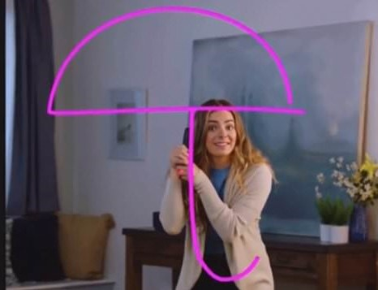

# Airart
Computer Vision based project which tracks a target and uses the said target to draw on air.

## Motivation for this idea
The initial motivation came when there was a need for a dustless class room for the students to study in. I know that there are many ways like touch screens and more but what about the schools which can’t afford it to buy such huge large screens and teach on them like a T.V. <br>
So, I thought why not can a finger be tracked, but that too at a initial level without deep learning. Hence it was OpenCV which came to the rescue.<br>

## Project Description
Ever wanted to draw our imagination by just waving your finger in the air?  In this project, we will build an Air Canvas which can draw anything on it by just capturing the motion of a colored marker with a camera. 
Here a colored object at the tip of the finger is used as the marker. We will be using the computer vision techniques of OpenCV to build this project. <br>
The preferred language is Python due to its exhaustive libraries and easy to use syntax but understanding the basics it can be implemented in any OpenCV supported language.<br>
Here Color Detection and tracking are used in order to achieve the objective. The color marker is detected and a mask is produced. It includes the further steps of morphological operations on the mask produced which are Erosion and Dilation. <br>
Erosion reduces the impurities present in the mask and dilation further restores the eroded main mask. <br>
 
# Introduction-
This is a simple computer vision based project which tracks a target and uses the said target to draw on air. The motion of the target is captured by a webcam. <br>
The video from the webcam is processed by the computer to get an AR like image overlay on top of the live footage. This project make use of a web cam to track the motion of the target.<br>
Each frame in the video is blurred using Gaussian blur to get a smooth image. The blurred image is then analysed to get the location of the pointing target. The image is then masked and centroid of target is found <br> Then a line is drawn from current frame to the previous frame.<br>


## Algorithm:


## It looks like



### Tools and Languages:


<br>

### Installing Libraries

```cmd
pip install numpy
pip install opencv

```

-> We will use numpy library because it contains a multi-dimensional array and matrix data structures. It can be utilised to perform a number of mathematical operations on arrays such as trigonometric, statistical, and algebraic routines.
-> We use OpenCV library because it is a cross-platform library using which we can develop real-time computer vision applications. It mainly focuses on image processing, video capture and analysis including features like face detection and object detection


### Steps to follow
-Install the given libraries<br>
-Download the code from the given github repository<br>
-Run the code<br><br>


###  steps followed while making this project:---
* Start reading the frames and convert the captured frames to HSV color space (Easy for color detection).<br>
* Prepare the canvas frame and put the respective ink buttons on it.<br>
* Adjust the track bar values for finding the mask of the colored marker.<br>
* Preprocess the mask with morphological operations (Eroding and dilation).<br>
* Detect the contours, find the center coordinates of largest contour and keep storing them in the array       for successive frames (Arrays for drawing points on canvas).<br>
* Finally draw the points stored in an array on the frames and canvas.<br>


-> It is going to motivate and will open a track towards the perpetual sea of AI(Artificial intelligence),    Deep-learning, AR(Augmented reality), VR(Virtual reality).<br>
  So, lets have a dive into it.<br>

-> Here is the output of the project <br> 

### Output


### Developed by:
<a href="https://github.com/sambit221">Sambit Kumar Tripathy</a>
